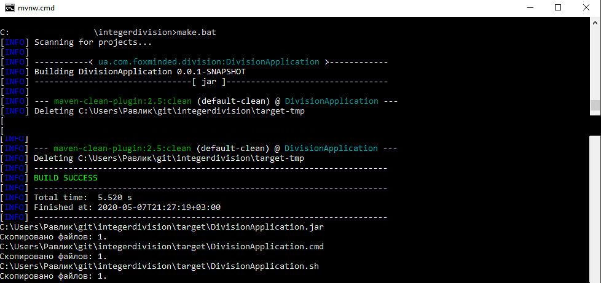
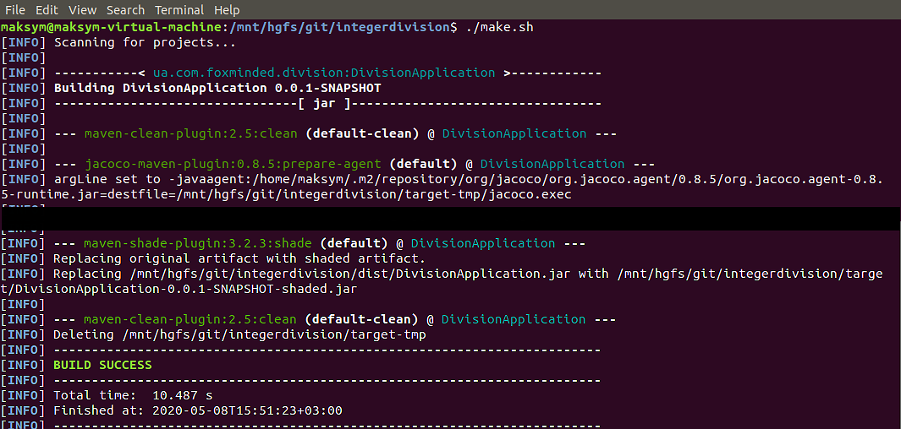
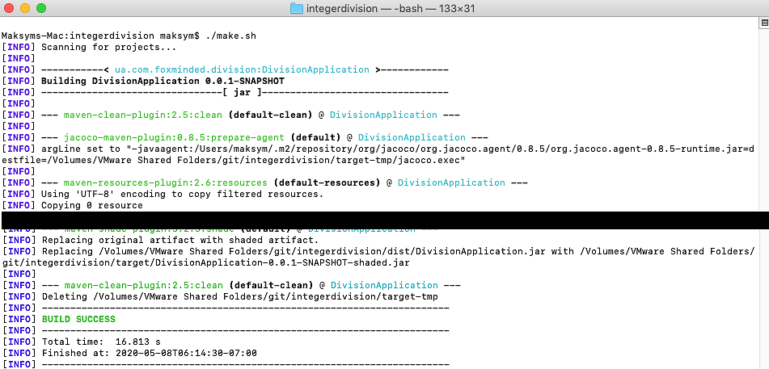
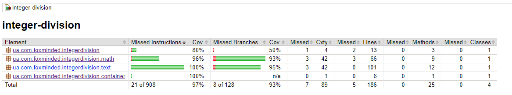

# Integer Division (Tasks 4) 
## Table of content  
* [Task](#Task)
* [How to build](#How-to-build)
* [File Structure](#File-structure)
* [Dependencies](#Dependencies)
* [Technologies](#Technologies)
* [Information and links](#Information-and-links)
* [Tests coverage report](#Tests-coverage-report)

## Task  
Write an application integer-division that divides integer numbers and prints result into console. + JUnit tests(!!!).

Example of result:


## How to build:  
Make sure that Java Development Kit (JDK) and Maven tool are installed on your machine.

There are two options how to build project:

* Windows:
   
   - double-click on `make.bat`:
  

  
   - or use Command Prompt:  navigate to project's root folder and type `make.bat` command:


      
   - or use `mvnw.cmd package` command in Terminal (Maven Wrapper)
   
   - or use `mvn package` command in Terminal (Maven)
      
* Linux/MacOS:

   - execute `make.sh` script file by using `./make.sh` command:
      

      

   
   - or use `./mvnw package` command in Terminal (Maven Wrapper)
   
   - or use `mvn package` command in Terminal with Maven

`make.bat` and `make.sh` will create a `dist` folder with application execution jar, batch and bash files. 

## File structure 
 ```bash
├── src
│   ├── main
│   │   └── java
│   │       │── ua/com/foxminded/integerdivision
│   │       │   └── Main.java
│   │       │
│   │       │── ua/com/foxminded/integerdivision/container
│   │       │   └── Context.java
│   │       │
│   │       │── ua/com/foxminded/integerdivision/math
│   │       │   └── Divider.java
│   │       │
│   │       └── ua/com/foxminded/integerdivision/text
│   │           └── LineFormatter.java
│   │           
│   └── test
│       └── java
│           │── ua/com/foxminded/integerdivision
│           │   └── MainTest.java
│           │
│           │── ua/com/foxminded/integerdivision/container
│           │   └── ContextTest.java
│           │
│           │── ua/com/foxminded/integerdivision/math
│           │   └── DividerTest.java
│           │
│           └── ua/com/foxminded/integerdivision/text
│               └── LineFormatterTest.java
|
├── docs
│   └── img
│       └── *.png
│-- target
├── .gitignore
├── make.bat
├── make.sh
└── README.md
```

## Dependencies: 
- JUnit Platform: junit-platform-console-standalone-1.6.0 ([download](https://mvnrepository.com/artifact/org.junit.platform/junit-platform-console-standalone/1.6.0))
- JUnit TestEngine API: junit-jupiter-api-5.6.0 ([download](https://mvnrepository.com/artifact/org.junit.jupiter/junit-jupiter-api/5.6.0))
- Mockito mocking framework for unit tests: mockito-all-1.10.19 ([download](https://mvnrepository.com/artifact/org.mockito/mockito-all/1.10.19))
- JaCoCo - Java Code Coverage Library 0.8.5 ([download](https://mvnrepository.com/artifact/org.jacoco/jacoco-maven-plugin/0.8.5))
- Maven Wrapper ([download](https://mvnrepository.com/artifact/io.takari/maven-wrapper))
- Maven Shade Plugin: maven-shade-plugin-3.2.3 ([download](https://apache.ip-connect.vn.ua/maven/plugins/maven-shade-plugin-3.2.3-source-release.zip))

## Technologies  Project is created with:
* Java EE 1.8
* Junit 5
* Maven

## Information and links 
- Java SE Runtime Environment 8 (JRE) ([download](https://www.oracle.com/technetwork/java/javase/downloads/jre8-downloads-2133155.html))
- Apache Maven ([download](https://maven.apache.org/download.cgi))
- Eclipse ([download](https://www.eclipse.org/downloads/))

## Tests coverage report
  